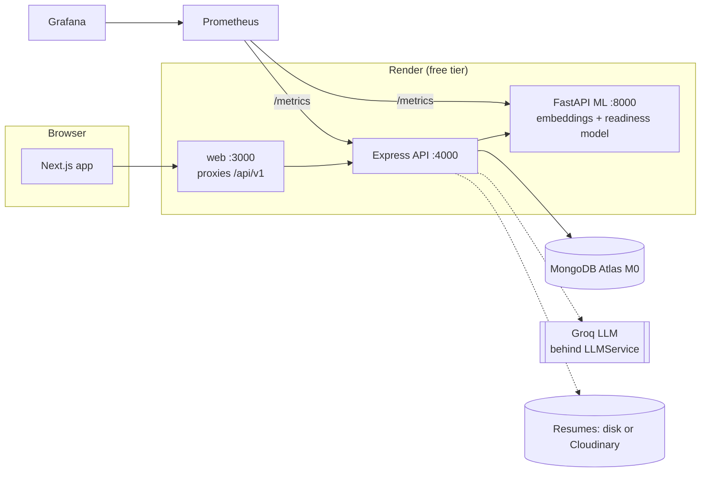
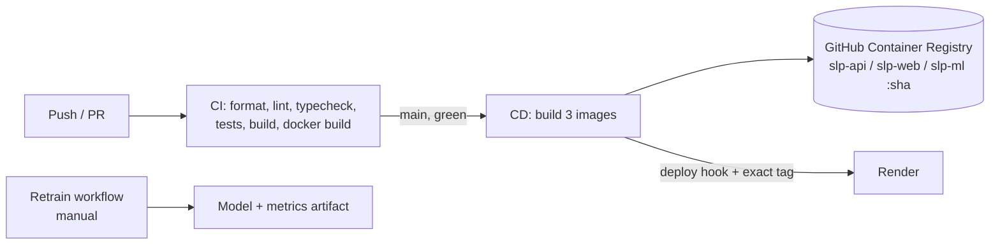
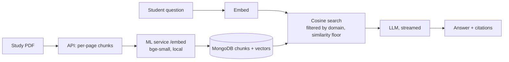

# Smart Learning & Placement Assistant

An AI-powered career learning and placement platform (M.Tech CSE course project: _AI Integrated Full Stack Application Development and DevOps_).
A student picks a career domain, sees the skills they are missing, follows a generated learning path, asks a mentor that answers **only from vetted
study material**, takes assessments and mock interviews, gets a readiness score with the reasons behind it, and finds matching exams, jobs and
fellowships to track. Admins manage domains, content, opportunities and see cohort analytics.

Status: **all phases complete** (0 scaffold, 1 auth and profiles, 2 domains and data pipeline, 3 AI core, 4 RAG mentor, 5 assessments and mock
evaluation, 6 readiness model, 7 opportunities and applications, 8 admin analytics, 9 DevOps). See [what is and is not verified](#what-is-verified-and-what-is-not)
before relying on any deployment step.

## Architecture





| Layer  | Choice                                                                                           |
| ------ | ------------------------------------------------------------------------------------------------ |
| Web    | Next.js 15 (App Router), TypeScript, Tailwind 4, React Query, Recharts                           |
| API    | Express, TypeScript, Zod (shared with the web app), Mongoose, pino logs, prom-client             |
| Data   | MongoDB (vectors stored in documents, cosine search in the API)                                  |
| AI     | Provider-agnostic `LLMService` (Groq by default); local `bge-small` embeddings; scikit-learn     |
| DevOps | Docker, Compose, GitHub Actions (CI, CD to GHCR, retrain), Render blueprint, Prometheus, Grafana |

## Setup

```bash
npm install
cp .env.example .env
npm run lint && npm run typecheck && npm test && npm run build
docker compose -f infra/docker-compose.yml --env-file .env up --build
```

Without Docker: run MongoDB locally, copy `apps/api/.env.example` to `apps/api/.env`, then
`npm run dev -w @slp/api` and `npm run dev -w @slp/web`.

API tests use `mongodb-memory-server`; the first run downloads a MongoDB binary (about 600 MB, cached afterwards).
ML tests: `cd services/ml && pip install -r requirements-dev.txt && pytest`

> **Windows note:** do not build from inside a OneDrive-synced folder (Desktop and Documents are synced by
> default). `next build` can hang there because OneDrive locks files under `.next`. Work from a path such as
> `C:\dev\...`, or exclude the folder from OneDrive sync.

## Auth and profile (Phase 1)

- Access JWT (15 min) and refresh JWT (7 days) in httpOnly, SameSite=Lax cookies. Refresh tokens are
  single-use and rotated. Reusing an old one revokes all of that user's sessions.
- Public sign-up always creates a `student`. Create mentors and admins with
  `npm run create-user -w @slp/api -- <email> "<name>" <role> <password>`.
- Role checks use `requireRole(...)` middleware (`apps/api/src/middleware/auth.ts`).
- Resume upload accepts PDFs up to 5 MB (verified by file signature, not just by extension), extracts text with
  pdf.js, and stores the file privately. Files are served only to their owner, through the API.
  Storage is local disk by default; set `CLOUDINARY_URL` to use Cloudinary (not yet exercised against a real account).
- Interactive API docs: <http://localhost:4000/api/docs>

| Method | Path                          | Auth | Purpose                             |
| ------ | ----------------------------- | ---- | ----------------------------------- |
| POST   | `/api/v1/auth/register`       | no   | Create a student account            |
| POST   | `/api/v1/auth/login`          | no   | Sign in                             |
| POST   | `/api/v1/auth/refresh`        | no   | Rotate the refresh token            |
| POST   | `/api/v1/auth/logout`         | no   | Revoke the refresh token            |
| GET    | `/api/v1/auth/me`             | yes  | Current user                        |
| GET    | `/api/v1/profile`             | yes  | Get the profile                     |
| PUT    | `/api/v1/profile`             | yes  | Update education, skills, interests |
| POST   | `/api/v1/profile/resume`      | yes  | Upload a resume PDF                 |
| GET    | `/api/v1/profile/resume/file` | yes  | Download your own resume            |
| DELETE | `/api/v1/profile/resume`      | yes  | Remove your resume                  |

## Domains and data pipeline (Phase 2)

Every career domain is a `DomainConfig` document, so adding one needs only a new config (through the admin editor at
`/admin/domains`, the API, or a JSON file in `data/seeds/domains/`), with no code change.

```bash
npm run seed:domains              # add any missing domains (never overwrites admin edits)
npm run seed:domains -- --update  # overwrite existing domains from the seed files
```

In Docker: `docker compose -f infra/docker-compose.yml exec api node apps/api/dist/scripts/seedDomains.js`.
Create an admin first with `npm run create-user -w @slp/api -- admin@example.com "Admin" admin <password>`.

| Method | Path                          | Auth    | Purpose                                |
| ------ | ----------------------------- | ------- | -------------------------------------- |
| GET    | `/api/v1/domains`             | no      | Active domains (summaries)             |
| GET    | `/api/v1/domains/:slug`       | no      | Full config of an active domain        |
| PUT    | `/api/v1/profile/domain`      | student | Choose or switch your active domain    |
| GET    | `/api/v1/admin/domains`       | admin   | All domains, including inactive        |
| POST   | `/api/v1/admin/domains`       | admin   | Create a domain                        |
| PUT    | `/api/v1/admin/domains/:slug` | admin   | Replace a config (slug is immutable)   |
| DELETE | `/api/v1/admin/domains/:slug` | admin   | Delete; 409 if students have it active |

**Skill benchmarks** combine hand-curated, exam-specific skills for the Indian context (75% of the weight) with
foundation skills, knowledge areas and tools derived from the O\*NET database (25%). Provenance is stored on every skill.
Healthcare and Law carry a required safety notice. Exam months are typical windows only; the UI says to confirm
on the official notification.

Data pipeline (`pip install -r scripts/requirements.txt` first). Sources, licenses and what was verified are in
[data/DATA_SOURCES.md](data/DATA_SOURCES.md).

```bash
npm run data:fetch      # O*NET, UCI, ESCO; Kaggle datasets too when a Kaggle token is configured
npm run data:process    # writes data/seeds/skill_benchmarks.json (committed, deterministic)
python -m pytest scripts  # pipeline tests run on fixtures only, no network
```

`npm run data:ingest` uploads study material for the mentor (see Phase 4 below).

## AI core (Phase 3)

All LLM calls go through `LLMService` (`apps/api/src/ai/llm`): Zod-validated JSON, one corrective retry, timeouts,
token and latency metrics (`llm_*` at `/metrics`), and logs that never contain prompts or profile text.
Swap vendors with env only: `LLM_PROVIDER=groq|gemini|openai|ollama|custom` (see `apps/api/.env.example`). Only Groq has
been tested against a real key; the default model is `openai/gpt-oss-120b`. Put the key in `apps/api/.env` (git-ignored).

| Method   | Path                             | Purpose                                                                     |
| -------- | -------------------------------- | --------------------------------------------------------------------------- |
| GET      | `/api/v1/discovery/quiz`         | Quiz (data in `data/seeds/discovery_quiz.json`)                             |
| POST/GET | `/api/v1/discovery/result`       | Top-3 domains with reasons (AI); saved result                               |
| POST     | `/api/v1/skill-gap/generate`     | Profile and resume vs the domain benchmark (AI levels, server-side scoring) |
| GET      | `/api/v1/skill-gap/latest`       | Latest report                                                               |
| POST     | `/api/v1/learning-path/generate` | Week-by-week plan from the latest report (AI)                               |
| GET      | `/api/v1/learning-path`          | Latest plan                                                                 |
| PATCH    | `/api/v1/learning-path/progress` | Tick or untick a goal                                                       |

Responsible-AI measures: untrusted profile and resume text is fenced and treated as data; resource suggestions avoid URLs
and invented authors and carry an on-screen verify notice; domain safety notices are injected into prompts and shown in the
UI; each user is capped at `AI_RATE_LIMIT_PER_HOUR` AI requests. Groq's free tier allows 8,000 tokens per minute, which is
about one or two full student flows per minute.

## AI mentor with RAG (Phase 4)

Students ask doubts at `/mentor`; answers are generated **only** from the study material uploaded for their active domain, stream in
token by token, and cite their sources (`[1]` badges that link to the passage, document title and page).



- **Embeddings** come from a local model (BAAI/bge-small-en-v1.5) behind `POST /embed` in `services/ml`: no API key and no rate limit.
  The first run downloads about 130 MB; the Docker image bakes it in.
- **Vector search** runs in the API over chunks stored in MongoDB, filtered by domain. This suits local MongoDB and thousands of chunks;
  switching to Atlas Vector Search later only changes `ai/rag/retrieve.ts`.
- **Refusal:** passages must score at least `RAG_MIN_SCORE` (0.6, calibrated on the real model: related questions 0.73-0.85, near-misses
  about 0.54, unrelated 0.35-0.46). If none do, the mentor says the material does not cover it and **no model is called**. The prompt
  also forbids adding facts the passages do not state.
- **Safety:** passage and question text is fenced as data; Healthcare and Law notices are injected and shown; per-user rate limit applies.

Add study material (admin, in the UI at `/admin/study-material`, or in bulk with the CLI). Every document needs a title, source and
license, because the mentor quotes it:

```bash
# data/raw/study-material/<domain-slug>/*.pdf  plus  sources.json:
#   {"file.pdf": {"title": "...", "source": "https://... or publisher", "license": "CC BY 4.0"}}
export SLP_ADMIN_EMAIL=admin@example.com SLP_ADMIN_PASSWORD=...   # PowerShell: $env:SLP_ADMIN_EMAIL=...
npm run data:ingest -- --dry-run     # preview
npm run data:ingest                  # idempotent: skips documents already uploaded
```

Only PDFs with selectable text are supported (scanned pages need OCR first). The mentor needs the ML service running
(`docker compose up`, or `uvicorn app.main:app` in `services/ml`).

## Assessments and mock evaluations (Phase 5)

**Assessments** (`/assessments`, admin review at `/admin/assessments`)

- An admin generates a **draft** with the LLM (MCQs and optional written questions). When the domain has study material, questions are
  written from it and marked _grounded_; otherwise they come from the skill list alone and the editor warns the reviewer to check facts.
  Answer options are shuffled server-side because models favour putting the right answer first.
- The reviewer edits every question and the answer key, then **publishes** (at least 3 valid questions). Students only ever see
  published assessments; published ones are read-only (unpublish, or duplicate into a new draft).
- Students get questions **without** answer keys. MCQs are auto-graded. Written answers are graded by the LLM against the key points
  (blank answers never reach the model); if grading fails the attempt stays open so nothing is lost. After submitting, the key,
  explanations and feedback are revealed. Time taken is recorded.

**Mock evaluation** (`/mock-eval`): a practice interview or practical task, per the domain's `mockEvaluation.type`. The LLM writes the
questions (favouring the student's weak skills) and scores every rubric criterion 0-10; the server computes the weighted overall score.
The rubric is snapshotted when the evaluation starts, so editing a domain later does not change old results.

**Voice interviews are disabled.** `VOICE_ENABLED=false` by default: `GET /api/v1/features` reports it, the UI shows no voice option, and the
API refuses `mode: "voice"` with 403 before calling any model. The VAPI integration is not built; enabling it later means adding that
module behind the same flag.

| Method  | Path                                                          | Purpose                               |
| ------- | ------------------------------------------------------------- | ------------------------------------- |
| POST    | `/api/v1/admin/assessments/generate`                          | Generate a draft (admin)              |
| GET/PUT | `/api/v1/admin/assessments[/:id]`                             | List, review and edit drafts          |
| POST    | `/api/v1/admin/assessments/:id/publish\|unpublish\|duplicate` | Review workflow                       |
| GET     | `/api/v1/assessments`                                         | Published assessments for your domain |
| POST    | `/api/v1/assessments/:id/start`                               | Start or resume an attempt            |
| POST    | `/api/v1/assessments/attempts/:id/submit`                     | Grade and reveal                      |
| POST    | `/api/v1/mock-eval/start`, `/:id/submit`; GET `/`, `/:id`     | Mock evaluation                       |

Quality notes from live runs against the real model: grounded questions followed the study notes and had correct keys; an ungrounded
banking question had an ambiguous key (several valid ID documents), so the prompt now requires exactly one defensible answer, but
**human review before publishing is essential**. Written-answer grading separated strong (5/5), partly right (0.5/5), vague and nonsense
(0/5) answers; mock scoring ordered strong (71.5) above mediocre (23) above nonsense (0). Scoring is deliberately strict.

## Career readiness (Phase 6)

`POST /api/v1/readiness/compute` turns what a student has done in their domain into a 0-100 **readiness score**, compares it with the
domain's target, and decides what happens next: **at or above target → opportunities**, **below → back to the learning path** with focus
areas (from the skill-gap report) and ranked next actions. The web app shows it at `/readiness` (gauge, what moved the score, the
signals, history chart) and on the dashboard.

**Signals (7):** best score per assessment averaged (retakes improve it rather than dilute it), mock-evaluation average, learning-path
completion, skill-benchmark coverage, mentor questions in the last 30 days (capped at 50), distinct active days in the last 30, and days
since last activity. Missing evidence counts as 0. Every snapshot stores these exact inputs, the score, the model version and
whether the fallback was used (`ReadinessSnapshot`), which is the dataset a future retrain needs.

**Fallback:** if the ML service is down, slow or returns something malformed, the API computes a transparent weighted formula
(`apps/api/src/readiness/fallback.ts`), stores `isFallback: true`, and the UI says so. A score is never unavailable because a service restarted.

### The model (`services/ml`)

|                              |                                                                                                                                                   |
| ---------------------------- | ------------------------------------------------------------------------------------------------------------------------------------------------- |
| `generate_synthetic_data.py` | 6,000 labelled students from documented assumptions (hidden aptitude, diligence and journey stage drive "ready"; the app only sees noisy signals) |
| `train.py`                   | compares logistic regression, **monotone** gradient boosting and a random forest; writes `models/readiness.joblib` and `models/metrics.json`      |
| `POST /predict`              | the 7 features (range-checked) → score, model version, top 3 factors with signed impact in score points                                           |
| `train_baseline.py`          | the same method on **real** data (Kaggle campus placement, UCI student performance)                                                               |
| `retrain_from_snapshots.py`  | exports snapshots from MongoDB and retrains once you supply real outcomes                                                                         |

Results on the synthetic holdout (1,200 rows; ready rate 46%):

| Model                           | Accuracy | F1    | ROC-AUC | Brier | Served?        |
| ------------------------------- | -------- | ----- | ------- | ----- | -------------- |
| Logistic regression             | 0.726    | 0.693 | 0.789   | 0.186 | no (see below) |
| **Gradient boosting, monotone** | 0.743    | 0.711 | 0.809   | 0.177 | **yes**        |
| Random forest (calibrated)      | 0.750    | 0.726 | 0.820   | 0.172 | no (see below) |

**Why the best AUC is not the served model.** Students are shown _why_ their score is what it is. The random forest lets
"asked zero mentor questions" _raise_ a weak student's score, and the logistic regression learned that more idle days raise readiness
(coefficient +0.108, a collinearity artefact). Both are untrustworthy explanations. The served model is constrained so more of any
positive signal can never lower the score and more idle days can never raise it; training sweeps every signal and refuses to serve a
model that violates this. The price is 0.011 AUC, and the artifact is 188 KB instead of 73 MB.

**Real-data baseline** (5-fold × 3 repeats; gender/sex, label-leaking `salary` and, for UCI, the prior-period grades are excluded):

| Dataset (rows)                | Majority-class accuracy | Logistic reg. (acc / ROC-AUC) | Random forest (acc / ROC-AUC) |
| ----------------------------- | ----------------------- | ----------------------------- | ----------------------------- |
| Kaggle campus placement (215) | 0.688                   | 0.848 / **0.935**             | 0.861 / 0.916                 |
| UCI student performance (649) | 0.846                   | 0.770 / 0.750                 | 0.806 / 0.778                 |

Placement outcomes are genuinely predictable from academic percentages. On UCI the models find signal (AUC 0.75-0.78) but their accuracy is
_below_ the majority-class baseline, because they are class-balanced to catch failures, so judge them by AUC there.

**What these numbers do and do not mean.** The synthetic labels come from a known formula, so good scores show the pipeline works, not that
real readiness is this predictable. The real datasets do not contain the app's features, so they show the method but cannot validate the
served model. The model has never seen a real student outcome.

**Retraining on real data.** After a placement season, record outcomes (`userId,domain,ready`) and run
`python retrain_from_snapshots.py --labels outcomes.csv` in `services/ml` (needs `pymongo`). It joins each student's latest snapshot to their
outcome and refuses to retrain below 200 labelled rows or with a single outcome. Docker trains the synthetic model at build time; mount a
retrained `models/` directory to replace it.

```bash
cd services/ml && python train.py                                  # synthetic model
python train_baseline.py --placement ../../data/raw/kaggle/placement/Placement_Data_Full_Class.csv \
                         --uci ../../data/raw/uci/student-performance/student-performance.csv
```

## Opportunities and applications (Phase 7)

Students find exams, jobs, internships and fellowships for their domain, see **why** each one fits them, and track applications on a board.
Pages: `/opportunities` (matched for you / browse all), `/applications` (board and alerts), `/admin/opportunities` (CRUD). The dashboard
shows the nearest deadline.

**Seed data.** `data/seeds/opportunities.json` holds 61 hand-written entries across all 12 domains (exams such as GATE, UGC NET and IBPS;
fellowships; internships; graduate recruitment programmes), each linking to the **official** page. No deadlines are seeded: they change every
year, so the UI says "check the official notice" rather than showing a date that may be wrong. Admins add dated entries. The LinkedIn jobs
dataset stays out (third-party scraped data, CC BY-SA). Links were checked on 2026-10-04: 39 of 41 distinct hosts resolved to the expected
page; `kvsangathan.nic.in` and `www.asrb.org.in` timed out from the test machine and are unconfirmed, and the NBE site blocks automated requests.

```bash
npm run seed:domains
npm run seed:opportunities              # idempotent by seedId; embeds each one (needs the ML service, else saved without vectors)
npm run seed:opportunities -- --reembed # recompute every vector
```

**Matching** (`apps/api/src/opportunities/matching.ts`), in layers that each degrade independently:

1. **Filters**: the student's domain, active, not past its deadline, wanted type.
2. **Similarity**: the profile (education, skills, interests, resume text) and each opportunity are embedded with the local `bge-small` model
   and compared by cosine similarity, shown as a 0-100 "match". It is a ranking guide for display, not a probability of success. Ties go to
   the earlier deadline. If embeddings are unavailable, ranking falls back to keyword overlap and the UI says so.
3. **Reasons**: for the top few, the LLM writes a one-or-two-sentence "why this fits you" and a "check this" caution from the eligibility text,
   using only the profile and the listing (student text is fenced as data; no invented dates or cut-offs). They are cached per profile, so a
   repeat visit makes no LLM call and a profile change refreshes them. If the LLM fails, matches are shown without explanations.

The response also carries the student's latest readiness against the target, so the page can say whether they are at the level the domain
asks for. Opportunities are shown either way; readiness informs, it does not gate.

**Application tracker.** One application per opportunity, five statuses (saved, applied, shortlisted, rejected, offered), a timestamped status
history, notes, and your own dated reminders ("Admit card", "Interview"). Cards move with a labelled status control instead of drag and
drop, so it works by keyboard, with a screen reader and on a phone. `GET /applications/alerts` is computed on request (no emails or schedulers):
opportunity deadlines within 14 days for saved items, your reminders within 14 days, and saved items whose deadline has passed. Rejected and
offered applications raise nothing. Deleting an opportunity removes students' cards for it.

**Resume evaluation** (`npm run eval:resumes`, needs seeded domains and the ML service). Each labelled resume is assigned the domain whose
description (name, summary, benchmark skills) is nearest by embedding, and the script reports how often that matches the resume's category.
Output goes to `data/processed/resume_eval_report.json` (git-ignored).

| 635 resumes, 12 domains                        | Top-1 | Top-3 |
| ---------------------------------------------- | ----- | ----- |
| Nearest-domain prediction                      | 54.8% | 81.4% |
| Always guessing the most common domain (floor) | 23.6% |       |

Per category (top-1 / top-3): teaching 90/100, banking 83/99, healthcare 82/92, civil 70/90, agriculture 50/76, software 46/88,
management 34/83, **law 4/34, mechanical 6/11**. Read the last two with care: the Kaggle `ADVOCATE` category is mostly child and family
advocates and administrative staff rather than lawyers, and `AUTOMOBILE` is mostly drivers, sales and claims staff rather than mechanical
engineers, so those labels do not describe our domains and the low scores reflect the labels at least as much as the method. `management` is
confused with `banking` (business-development and finance resumes overlap). The mapping in `data/seeds/resume_category_map.json` was left as
is rather than tuned to flatter the number; narrowing it to categories that clearly match is a reasonable follow-up. This measures
description-to-resume similarity only; it is not a measure of how good the opportunity matches are.

## Admin analytics (Phase 8)

`GET /api/v1/admin/analytics?days=30` (admin only) and the page `/admin/analytics` show how the cohort is doing:

- **Readiness by domain:** students, how many are scored, the average, the domain's target, and how many are at or above it. Each student
  counts once per domain, using their **latest** score (not every snapshot), so someone who recomputes ten times does not outweigh others.
  A domain nobody is scored in shows a dash, never a misleading 0.
- **Module usage:** for skill-gap, learning path, mentor, assessments, mock evaluations, readiness checks and tracked applications: students and
  records, all time and in the recent window (7, 30 or 90 days). Abandoned assessment attempts and unfinished mock evaluations are not usage.
- **Also:** active students (staff accounts are excluded so testing a page does not inflate it), how many scores came from the fallback formula
  rather than the model, the most attempted assessments with average score, the application funnel, and how many opportunities lack a vector.

**Privacy.** Everything returned is a count, average or share. No name, email or per-student record leaves the API, which a test asserts, so the
page can be shown to staff who should not see individual records. With fewer than 10 students the page warns that averages swing with every
new person.

**Accessibility.** The numbers are real tables (captions, row and column headers); the two Recharts charts (average readiness vs target, students per
module) are loaded client-side and have text labels, with the tables carrying the same figures for screen readers and keyboard users.

## DevOps (Phase 9)

### CI, CD and retraining

| Workflow      | Trigger                           | What it does                                                                                                                                                                                                                                                |
| ------------- | --------------------------------- | ----------------------------------------------------------------------------------------------------------------------------------------------------------------------------------------------------------------------------------------------------------- |
| `ci.yml`      | every push and PR                 | format check, lint, typecheck, all tests, build; Python lint and tests; builds the three Docker images                                                                                                                                                      |
| `cd.yml`      | CI succeeded on `main`, or manual | builds and pushes `slp-api`, `slp-web`, `slp-ml` to GHCR tagged with the commit (`sha-...`) and `latest`, then calls each service's Render deploy hook **with that exact tag**; skips a service whose hook secret is unset                                  |
| `retrain.yml` | manual (`workflow_dispatch`)      | runs the ML tests, regenerates the synthetic data and retrains, enforces a quality gate (served model must be monotone and meet a minimum holdout ROC-AUC, default 0.75), writes a metrics table to the run summary, uploads the model files as an artifact |

CD never builds a commit that failed CI, and a deploy names an exact image, so what runs in production is traceable to a commit. `retrain.yml` does not deploy:
download the artifact, place `readiness.joblib` in `services/ml/models/`, and rebuild the ML image (the Dockerfile trains at build time, so to ship a
retrained file instead, replace that step). Retraining on **real outcomes** is a separate manual step (`services/ml/retrain_from_snapshots.py`, see Phase 6).

### Deploying to Render (free tier)

Target chosen: **Render, free plans only**. [`render.yaml`](render.yaml) defines three web services that run the GHCR images: `slp-ml`, `slp-api`, `slp-web`.

Why the web app proxies the API: Render gives each service its own `*.onrender.com` host, and `onrender.com` is a public suffix, so the two are different
_sites_ and the browser would not send our `SameSite=Lax` login cookies from the web app to the API. The web image therefore forwards `/api/v1/*` to the API
(`apps/web/next.config.mjs`), and the browser only talks to one origin. This was verified locally: signing in through the web port sets the HttpOnly cookies and
authenticated and role-restricted calls behave correctly through the proxy.

Steps (about 30 minutes, one time):

1. **MongoDB Atlas.** Create a free M0 cluster, a database user, and allow network access (the free tier has no fixed Render IPs, so `0.0.0.0/0` with a strong password).
   Copy the connection string; this is `MONGO_URI`. Atlas M0 has no automated backups (see Operations).
2. **GitHub.** Push the repository. In `render.yaml` replace `OWNER` (three places) with your lowercase GitHub username. Wait for CI, then CD, to push the images.
   In GitHub, open each package (`slp-api`, `slp-web`, `slp-ml`) and set its visibility to **public** (or give Render a registry credential).
3. **Render.** New > Blueprint > pick the repository. Fill the prompted values: `MONGO_URI`, `GROQ_API_KEY`, `BOOTSTRAP_ADMIN_EMAIL`, `BOOTSTRAP_ADMIN_PASSWORD`
   (a strong one), `CORS_ORIGIN` = the web service's URL (for example `https://slp-web.onrender.com`; leave `CLOUDINARY_URL` empty unless you have one), and
   `ML_SERVICE_URL` = the ML service's public URL (for example `https://slp-ml.onrender.com`). Free services cannot receive private-network traffic, so the
   API calls the ML service publicly; `ML_API_TOKEN` is generated on `slp-ml` and passed to the API, so only the API can use `/embed` and `/predict`.
4. **Tell CD where the API lives.** In GitHub > Settings > Secrets and variables: add the repository **variable** `API_PUBLIC_URL` (the API's `https://...onrender.com`)
   and the **secrets** `RENDER_DEPLOY_HOOK_ML`, `RENDER_DEPLOY_HOOK_API`, `RENDER_DEPLOY_HOOK_WEB` (each service > Settings > Deploy Hook). Run the **CD** workflow once
   manually so the web image is rebuilt with the API address baked in.
5. **First sign-in.** Open the web URL, sign in as the bootstrap admin, then **delete `BOOTSTRAP_ADMIN_PASSWORD`** in Render. Domains and opportunities were seeded on first start
   (`AUTO_SEED`). Upload study material from the admin pages to enable the mentor.

What to expect on the free tier:

- Services sleep after 15 minutes without traffic; the first request after that takes about a minute.
- **512 MB RAM.** The ML service (embedding model plus the readiness model) is the likely one to run out. If it does, delete `slp-ml` and the `ML_SERVICE_URL` entry:
  the app keeps working with the weighted readiness formula and keyword matching, and says so. Mentor answers need embeddings, so without ML the mentor reports it is unavailable.
- Resume files on the free ephemeral disk disappear on redeploy (the extracted text stays in the database, so the AI features still work). Set a free `CLOUDINARY_URL` to keep files.
- Groq's free tier is capped at about 8,000 tokens a minute; the API waits briefly and retries, then reports that the AI service is busy.
- No paid services are used or required.

### Monitoring

`docker compose -f infra/docker-compose.yml --env-file .env up --build` also starts Prometheus (<http://localhost:9090>) and Grafana (<http://localhost:3001>, user `admin`, password from
`GRAFANA_ADMIN_PASSWORD`). The dashboard **Smart Learning: overview** is provisioned from `infra/grafana/dashboards/slp-overview.json`: request rate, p95 latency by route, 5xx ratio, LLM
calls by outcome, LLM latency and tokens per minute, readiness scores by source (ML vs fallback), embedding throughput and latency, and memory for the API and ML service. Alert rules in
`infra/prometheus/alerts.yml` (service down, high error rate, LLM provider failing, fallback in use) show at <http://localhost:9090/alerts>; sending them to email or chat would need Alertmanager, which is not set up.

Both services expose `/metrics`. On a public deployment, set `METRICS_TOKEN` on the API: `/metrics` then requires `Authorization: Bearer <token>` (`/health` stays open for the host's health check).
Render's free tier has no place to run Prometheus; to monitor the deployment, point a free Grafana Cloud agent at the two `/metrics` endpoints (not set up here).
Logs are structured JSON (pino). The code does not log request bodies, prompts, answers or resume text (a test asserts this for LLM calls).

### Operations

- **Backups.** Atlas M0 has none. Take a dump with `mongodump --uri "$MONGO_URI"` before anything risky, and keep it private: it contains emails, resume text and hashed passwords.
- **Rotating secrets.** Changing `JWT_*` secrets signs everyone out. The Groq key can be swapped at any time (an env change only). The Groq key used in development was pasted into a chat: rotate it.
- **Switching LLM provider.** Set `LLM_PROVIDER` (`groq`, `gemini`, `openai`, `ollama`, `custom`) and its key. Only Groq has been exercised against a real key.
- **Seeding.** `npm run seed:domains` and `npm run seed:opportunities` locally, or `AUTO_SEED=true` on a host with no shell. Both are idempotent and never overwrite admin edits.
- **Single-server alternative.** `infra/docker-compose.prod.yml` runs the same images on one machine you control (for example an EC2 instance); it is not exercised.

## What is verified and what is not

| Area                                                                                           | Status                                                                                                                                                                         |
| ---------------------------------------------------------------------------------------------- | ------------------------------------------------------------------------------------------------------------------------------------------------------------------------------ |
| API tests (252), web tests (75), data scripts (24), ML service (39 + 1 skipped)                | pass locally                                                                                                                                                                   |
| Format, lint, typecheck, production `next build`                                               | clean locally                                                                                                                                                                  |
| Real end-to-end runs (MongoDB, ML service with the real embedding model, Groq, browser)        | done: mentor, assessments, readiness, opportunity matching, tracker, analytics, same-origin proxy                                                                              |
| Retrain workflow steps and quality gate                                                        | run locally with the same commands (pass at 0.75, correctly fail at 0.9); the workflow itself has not run on GitHub                                                            |
| `ci.yml`, `cd.yml`, `retrain.yml`, `render.yaml`, compose files, Grafana and Prometheus config | **YAML parses; never executed.** No Docker or git was available, so no image was built, nothing was pushed, deployed or scraped, and the dashboard was never opened in Grafana |
| Render specifics (image runtime, public ML URL + token, deploy hook with `imgURL`)             | written from Render's documented behaviour; **untested against a real account**                                                                                                |
| Cloudinary storage, Gemini/OpenAI/Ollama presets                                               | untested                                                                                                                                                                       |
| Mentor streaming (SSE) through the web proxy                                                   | proxy verified for normal calls; streaming through it is **untested** (compression is disabled to help)                                                                        |

Expect to debug the first real deployment. The most likely snags are package visibility on GHCR, the ML service's memory, and a mismatched `CORS_ORIGIN`.

## Limitations and responsible use

- **The readiness model has never seen a real student outcome.** It is trained on synthetic data from documented assumptions, so its scores show the pipeline and the explanations work, not that real
  readiness is this predictable. Real-data baselines (Kaggle placement, UCI) show the method, not the served model's accuracy. Treat the score as guidance, never as a decision about a person.
- **AI output is advisory.** The mentor refuses rather than guess when the study material does not cover a question; generated quizzes, grades, match reasons and learning paths can still be wrong, and
  assessments must be reviewed by a human before publishing. Match percentages rank profile similarity; they are not a chance of success.
- **Opportunities are hand-written from official pages, with no deadlines seeded.** Links were checked on 2026-10-04 (two hosts unreachable from the test machine). Always confirm eligibility and dates on the official notice.
- **Resume evaluation is modest:** 54.8% top-1 and 81.4% top-3 over 635 resumes against a 23.6% baseline, and two categories (law, mechanical) are poorly labelled in the source dataset.
- **Privacy.** Resume text and profile data are stored; analytics returns aggregates only; logs do not include prompts or content; students see only their own records. There is no deletion-on-request workflow beyond removing a resume.
- **Voice interviews are disabled** by decision (`VOICE_ENABLED=false`); the API refuses `mode: "voice"` and the UI hides it. No notifications are sent: deadline alerts are computed when a student opens the app.
- Datasets and licences are listed in [`data/DATA_SOURCES.md`](data/DATA_SOURCES.md). Raw and processed data are never committed.
